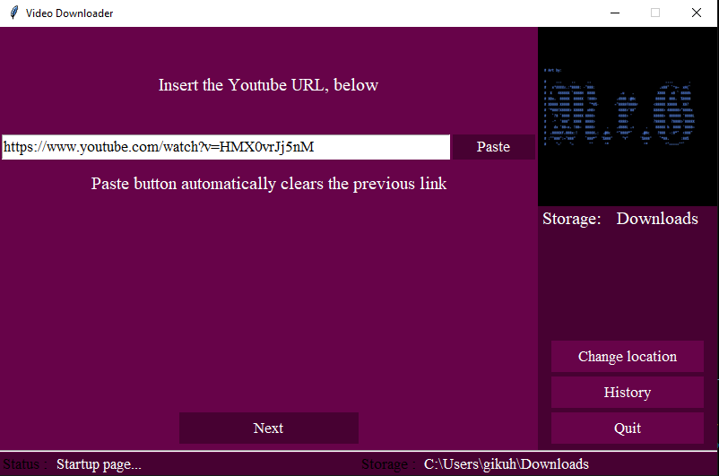

# Python-You-Tube-Video-Downloader

## **Installation**
Open the command prompt and run the following command:
 ``` 
  pip3 install -r requirements.txt 
  ```

## **Overview**
### Home page

Press the paste button to paste the YouTube video url. You can change the download location before the download begins to either Downloads or ask.



### Download page


Download the video based on the resolution you want.


### Issues

The 1080p and 480p video download, downloads the video and audio seperately
I have not managed to merge the video and audio so feel free to contribute


Contact: Gikuhiezekiel@gmail.com
